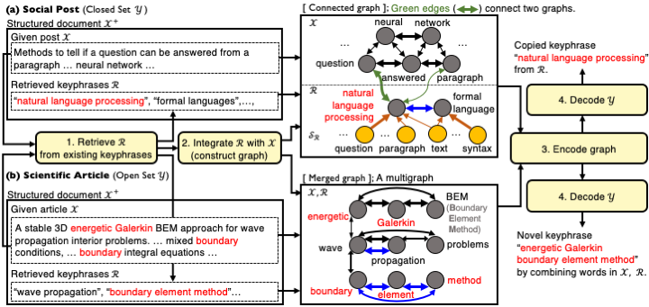

# Structure-Augmented Keyphrase Generation

This PyTorch code was used in the experiments of the research paper.

* [**Structure-Augmented Keyphrase Generation**.](https://aclanthology.org/2021.emnlp-main.209.pdf) Jihyuk Kim, Myeongho Jeong, Seungtaek Choi, and Seung-won Hwang (EMNLP'21).

Targeting **keyphrase generation** task, 
given a document as input,
we first extend the given document with related but absent keyphrases from existing keyphrases, to augment missing contexts (_generating structure_), and then, build a graph of keyphrases and the given document, to obtain structure-aware representation of the augmented text (_encoding structure_).

If there are any questions, please send Jihyuk Kim an email: jihyukkim@yonsei.ac.kr.

## Open set KG

For open set KG, we experimented using KP20k, scientific publication dataset.
Most of the codes are adapted from [keyphrase-generation-rl](https://github.com/kenchan0226/keyphrase-generation-rl) (Neural Keyphrase Generation via Reinforcement Learning with Adaptive Rewards. ACL 2019. Chan et al).
We used preprocessed dataset from [KG-KE-KR-M](https://github.com/Chen-Wang-CUHK/KG-KE-KR-M) (An Integrated Approach for Keyphrase Generation via Exploring the Power of Retrieval and Extraction. NAACL 2019. Chen et al).
<!-- ([Link](https://www.dropbox.com/s/lgeza7owhn9dwtu/Processed_data_for_onmt.zip?dl=1)) -->

For experiments, you can follow the scripts below.

**1. Download & Preprocess data**

```bash
wget https://www.dropbox.com/s/lgeza7owhn9dwtu/Processed_data_for_onmt.zip?dl=1
unzip Processed_data_for_onmt.zip\?dl\=1 
rm Processed_data_for_onmt.zip\?dl\=1 

mkdir -p data/kp20k_filtered
# train data
cp data/Processed_data_for_onmt/Training/word_kp20k_training_context_filtered.txt data/kp20k_filtered/train_src.txt
cp data/Processed_data_for_onmt/Training/word_kp20k_training_context_nstpws_sims_retrieved_keyphrases_filtered.txt data/kp20k_filtered/train_ret.txt
cp data/Processed_data_for_onmt/Training/word_kp20k_training_keyword_filtered.txt data/kp20k_filtered/train_trg.txt
# validation data
cp data/Processed_data_for_onmt/Validation/word_kp20k_validation_context_filtered.txt data/kp20k_filtered/valid_src.txt
cp data/Processed_data_for_onmt/Validation/word_kp20k_validation_context_nstpws_sims_retrieved_keyphrases_filtered.txt data/kp20k_filtered/valid_ret.txt
cp data/Processed_data_for_onmt/Validation/word_kp20k_validation_keyword_filtered.txt data/kp20k_filtered/valid_trg.txt
# test data
cp data/Processed_data_for_onmt/Testing/word_kp20k_testing_context.txt data/kp20k_filtered/test_src.txt
cp data/Processed_data_for_onmt/Testing/word_kp20k_testing_context_nstpws_sims_retrieved_keyphrases_filtered.txt data/kp20k_filtered/test_ret.txt
cp data/Processed_data_for_onmt/Testing/word_kp20k_testing_keyword.txt data/kp20k_filtered/test_trg.txt

rm -r data/Processed_data_for_onmt*

# Preprocessing
# w/o title
cd open_set
python preprocess.py -data_dir ../data/kp20k_filtered -vocab_size 50000
# w/ title
mkdir -p ../data/kp20k_filtered_title
cp ../data/kp20k_filtered/*.txt ../data/kp20k_filtered_title/
python preprocess.py -data_dir ../data/kp20k_filtered_title -vocab_size 50000 -use_title
cd ../
```

**2. Training**

```bash
cd open_set
source train.sh [device] [enc_layers] [title]
```
	
* \[**device**\] denotes GPU index, used as ``CUDA_VISIBLE_DEVICES=$device``.
* \[**enc_layers**\] denotes the number of GCN layers. We used 3 in our experiments.
* \[**title**\] denotes whether to use title information. For example, ``source train.sh 0 3 title`` uses title information, and ``source train.sh 0 3`` do not use title.


**3. Prediction and Evaluation**

```bash
cd open_set
source predict.sh [device] [enc_layers] [title]
```


## Closed set KG
For closed set KG, we experimented using social media posts such as Twitter, Weibo, and StackExchange.
We used the preprocessed datasets from  [TAKG](https://github.com/yuewang-cuhk/TAKG).

**1. Download & Preprocess data**
To-do

**2. Training**
To-do

**3. Prediction and Evaluation**
To-do


### Cite the Paper!

To cite the paper splits, please use this BibTex:

```
@inproceedings{kim2021structure,
  title={Structure-Augmented Keyphrase Generation},
  author={Kim, Jihyuk and Jeong, Myeongho and Choi, Seungtaek and Hwang, Seung-won},
  booktitle={Proceedings of the 2021 Conference on Empirical Methods in Natural Language Processing},
  pages={2657--2667},
  year={2021}
}
```


<!-- <p align="center">
  
</p>
<p align="center">
  <b>Figure:</b> Overall approach of structure-augmented keyphrase generation on two scenarios (closed/open-set keyphrase).
</p> -->


<!-- ### Run the Code!

#### Prerequisite
- ```$ sudo apt-get install p7zip```
- PyTorch 1.0
- Other requirements are listed in `requirements.txt`.

#### 1. Preprocess Dataset

We provided a shell script `dataset/yelp2013/download_yelp.sh` that downloads and preprocess the Yelp 2013 dataset. Preprocessing can be similarly done with other datasets as well (see below for download links).

We also provided the vocabulary and word vectors used in our experiments (in the `predefined_vocab/yelp2013` directory) to better replicate the results reported in the paper.

#### 2. Train and Test the Models

The `src/main.py` trains the model using the given training and dev sets, and subsequently tests the model on the given test set. There are multiple arguments that need to be set, but the most important (and mandatory) ones are the following:

- `model_type`: the type and method of customization, which can be assigned as either `BiLSTM` (no customization), or `<location>[_basis]_cust`, where `<location>` can be any of the following: word, encoder, attention, linear, bias.
- `domain`: the dataset directory name (e.g. yelp2013)
- `num_bases`: the number of bases (only required when basis customization is used)

An example execution is:

~~~bash
python3 -W ignore main.py \
--model_type linear_basis_cust \
--num_bases 4 \
--domain yelp2013 \
--vocab_dir ../predefined_vocab/yelp2013/42939.vocab \
--pretrained_word_em_dir ../predefined_vocab/yelp2013/word_vectors.npy \
--train_datadir ../dataset/yelp2013/processed_data/train.txt \
--dev_datadir ../dataset/yelp2013/processed_data/dev.txt \
--test_datadir ../dataset/yelp2013/processed_data/test.txt \
--meta_dim 64 \
--key_query_size 64 \
--word_dim 300 \
--state_size 256 \
--valid_step 1000 \
~~~

### Download the Datasets!

There are three datasets used in the paper: Yelp 2013, AAPR, and PolMed.

To download Yelp 2013, refer to the following <a href="https://drive.google.com/open?id=1PxAkmPLFMnfom46FMMXkHeqIxDbA16oy">link</a> from the original authors.

Although they were constructed by different authors (please refer to these links for <a href="https://github.com/lancopku/AAPR">AAPR</a> and <a href="https://www.figure-eight.com/">PolMed</a>, we use specific data splits for the AAPR and PolMed datasets.
Download our splits <a href="https://github.com/zizi1532/BasisCustomize/releases/download/1.0/datasets.zip">here</a>.

### Cite the Paper!

To cite the paper/code/data splits, please use this BibTex:

```
@article{kim2019categorical,
	Author = {Jihyeok Kim and Reinald Kim Amplayo and Kyungjae Lee and Sua Sung and Minji Seo and Seung-won Hwang},
	Journal = {TACL},
	Year = {2019},
	Title = {Categorical Metadata Representation for Customized Text Classification}
}
``` -->


